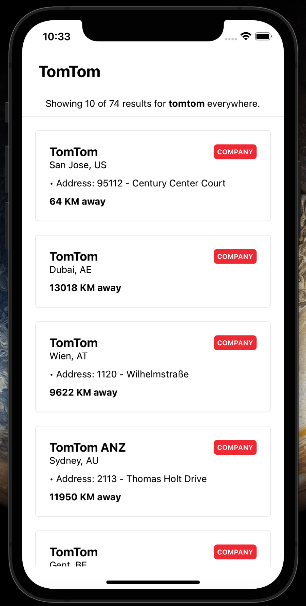

# Sojourner

A small IOS application utilizing [TomTom](https://developer.tomtom.com/search-api/search-api-documentation-search/points-interest-search)'s *Points of Interest* API.
Works with geo-location through a native module to fetch data.

## Adding TOMTOM_API_KEY to xcode

Like most APIs, TomTom's requires a `key` containing a valid API key to send along with the request.

Add a key is easy and can be done in two ways:

* Via `sojourner.xcscheme`

1. Navigate to `ios/sojourner.xcodeproj/xcshareddata/xcshemes/sojourner.xcscheme`

2. Add your key in the empty `value` field under the `EnvironmentVariable` where `key` is *TOMTOM_API_KEY*

* Via Xcode

1. Open `ios/sojourner.xcworkspace`

2. Navigation to `Product` > `Scheme` > `Edit Scheme...` > `Run`

3. Under *Environment Variables*, add your key next to *TOMTOM_API_KEY*.

## Installation

Follow these steps to install the application after cloning/downloading the repo

**Disclaimer** The project can only run on MacOS, intallation will fail on Windows.

* Install npm dependencies
> `npm i` or `npm ci`

* Install pods
> `cd ios/` & `pod install`

* Running the app
> `npm run ios`

## Screenshot

